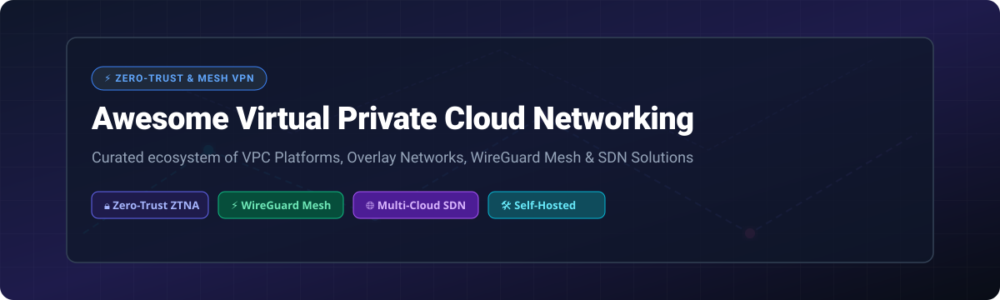

# 🌐 Awesome Virtual Private Cloud (VPC) & Zero-Trust Mesh Networking Ecosystem 🚀

   

> 💡 A curated ecosystem list of **Virtual Private Cloud (VPC) Networking SaaS platforms** ☁️, **Zero-Trust Overlay Mesh VPNs** 🔒, and **Open-Source Software-Defined Networking (SDN) solutions** 🛠️.

*Connect servers 🖥️, containers 🐳, edge devices 📱, and remote workers 💻 seamlessly across multi-cloud and hybrid infrastructure using WireGuard ⚡, eBPF 🧠, and Zero Trust Network Access (ZTNA) 🛡️.*

📅 **Last updated: October 2026**

---

## 📑 Table of Contents
- [📊 Market Overview & Ecosystem Structure](#-market-overview--ecosystem-structure)
- [☁️ SaaS & Managed VPC Platforms](#️-saas--managed-vpc-platforms)
- [🛠️ Open-Source GitHub Projects](#️-open-source-github-projects)
- [🏗️ Architecture Comparison & Selection Framework](#️-architecture-comparison--selection-framework)
- [🤝 How to Contribute](#-how-to-contribute)
- [❤️ Support & Community](#️-support--community)
- [⭐ Star History](#-star-history)
- [⚠️ Disclaimer](#️-disclaimer)

---

## 📊 Market Overview & Ecosystem Structure

> [!NOTE]
> 📈 **Market Size & Dynamics**: The **Virtual Private Cloud (VPC)** and **Cloud Networking** market is valued at approximately **$35 Billion – $68 Billion** (projected to reach **$85B+ by 2035** with a CAGR of **12%–22%**). 
>
> 🏢 The market is **highly concentrated at the infrastructure layer** (dominated by cloud giants AWS, Azure, and GCP) but **highly fragmented in the Zero-Trust mesh VPN and overlay layer** (where specialized vendors like Tailscale, Cloudflare, NetBird, and Netmaker compete alongside open-source self-hosted solutions).

---

## ☁️ SaaS & Managed VPC Platforms

The table below lists top commercial SaaS & managed VPC networking solutions, ranked by parent company size (valuation / revenue / market cap, descending):

| Platform | Starting Paid Price | Free Tier / Trial Limit | Company Size / Valuation | Description |
| :--- | :--- | :--- | :--- | :--- |
| **[Google Cloud VPC](https://cloud.google.com/vpc)** | $0.01/GB outbound data transfer (VPC core is $0 base) | $300 free credits (90 days) + Always Free tier compute/storage | **$4.1 Trillion** market cap (Alphabet) | 🌐 GCP's global virtual network with auto-subnets, global routing, and shared VPCs for enterprise projects. |
| **[Azure Virtual Network](https://azure.microsoft.com/en-us/products/virtual-network/)** | $0.035/hr per VNet Gateway ($0 base for VNet creation) | $200 free credits (30 days) + 12 months free popular services | **$3.7 Trillion** market cap (Microsoft) | 🏢 Microsoft's isolated VPC networking with NSGs, subnets, route tables, and ExpressRoute hybrid links. |
| **[Amazon VPC](https://aws.amazon.com/vpc/)** | $0.045/hr per NAT Gateway + $0.005/hr per public IP ($0 base VPC) | 750 hrs/month EC2 free tier + 100 GB/month data transfer out | **$2.7 Trillion** market cap (Amazon) | 📦 AWS's foundational virtual cloud network with complete control over IP routing, subnets, and gateways. |
| **[Cloudflare Magic WAN](https://www.cloudflare.com/)** | $5/user/month (Cloudflare Zero Trust starter) | Free tier for Cloudflare Zero Trust up to 50 users | **$124.6 Billion** market cap (NYSE: NET) | ⚡ Enterprise WAN-as-a-Service connecting branch offices and VPCs through Cloudflare's global edge network. |
| **[Perimeter 81](https://www.perimeter81.com/)** | $8/user/month (Essential plan, 5 seat min) | 30-day money-back guarantee (no perpetual free tier) | **$490 Million** (Acquired by Check Point) | 🔑 Zero Trust Network Access (ZTNA) platform with SaaS admin console and encrypted cloud gateways. |
| **[Tailscale](https://tailscale.com/)** | $8/user/month (Starter plan) | Free forever for up to 6 users, unlimited devices per user | **$1.5 Billion** valuation (Private VC) | 🚀 Popular WireGuard-based mesh VPN with SaaS coordination plane, MagicDNS, and seamless client apps. |
| **[ZeroTier](https://www.zerotier.com/)** | $5/month (Professional plan, up to 25 devices) | Free forever for up to 10 devices & 1 network admin | **$24.2 Million** total raised (Private) | 🔌 Ethernet-layer mesh networking platform connecting devices across subnets with custom software-defined switches. |
| **[Netmaker SaaS](https://www.netmaker.io/)** | $2/active connection/month (Community SaaS) | 14-day free cloud trial (Self-hosted edition is 100% free) | **$2 Million** ARR (YC-backed) | 🏎️ Managed high-performance kernel WireGuard mesh VPN for enterprise multi-cloud container networking. |
| **[Pritunl](https://pritunl.com/)** | $10/month per host (Premium edition) | Free forever Community Edition (Single server instance, unlimited clients) | **Private Bootstrapped** | 🛡️ Enterprise VPN server supporting OpenVPN and WireGuard with web admin console and SSO integrations. |

---

## 🛠️ Open-Source GitHub Projects

The top open-source VPC networking, mesh VPN, and overlay infrastructure repositories, sorted by **GitHub Stars_Count (descending)**:

| Project | GitHub_Stars | License | Description |
| :--- | :--- | :--- | :--- |
| **[frp](https://github.com/fatedier/frp)** |  | Apache-2.0 | ⚡ A high-performance reverse proxy for exposing local servers behind NAT or firewalls to the internet via secure tunnels. |
| **[Headscale](https://github.com/juanfont/headscale)** |  | BSD-3-Clause | 🔓 Open-source self-hosted implementation of the Tailscale control server. Allows using official Tailscale clients without vendor lock-in. |
| **[NetBird](https://github.com/netbirdio/netbird)** |  | BSD-3-Clause | 🦅 Zero-trust WireGuard mesh VPN with integrated SSO/IdP authentication, self-hosted management dashboard, and automated peer routing. |
| **[Nebula](https://github.com/slackhq/nebula)** |  | MIT | 🌌 Portable overlay networking tool created by Slack focused on performance, security, and scalability across multi-cloud clusters. |
| **[Pritunl Server](https://github.com/pritunl/pritunl)** |  | Enterprise/GPLv3 | 🔒 Distributed OpenVPN and WireGuard server software with intuitive web management dashboard and multi-tenant support. |
| **[rathole](https://github.com/rapiz1/rathole)** |  | Apache-2.0 | 🦀 Lightweight, high-performance reverse proxy for NAT traversal written in Rust. Fast alternative to frp and ngrok. |
| **[Nmap](https://github.com/nmap/nmap)** |  | Nmap Public Source | 🔍 Network discovery and security auditing utility essential for VPC network topology mapping and vulnerability scanning. |
| **[Netmaker](https://github.com/gravitl/netmaker)** |  | SSPL-1.0 | 🚀 Fast open-source WireGuard mesh networking platform utilizing Linux kernel WireGuard for flat overlay VPC connectivity across clouds. |
| **[LXD](https://github.com/lxc/lxd)** |  | AGPL-3.0 | 📦 Container and VM management daemon providing virtual network bridges, OVN software-defined networking, and private cloud VPC isolation. |
| **[Incus](https://github.com/lxc/incus)** |  | Apache-2.0 | 🔀 Community fork of LXD for system container & VM orchestration with full OVN SDN multi-tenant network isolation. |
| **[innernet](https://github.com/tonarino/innernet)** |  | MIT | 🔑 A private network system created by Tonari that builds internal WireGuard networks with CIDR-based authorization rules. |
| **[Open vSwitch (OVS)](https://github.com/openvswitch/ovs)** |  | Apache-2.0 | 🔀 Production-quality multilayer virtual switch used as the core SDN engine in OpenStack, Kubernetes CNI, and enterprise cloud networks. |
| **[WireGuard Tools](https://github.com/WireGuard/wireguard-tools)** |  | GPL-2.0 | 🛠️ Command-line tools (`wg`, `wg-quick`) for configuring WireGuard encrypted tunnel interfaces. |
| **[Pritunl Zero](https://github.com/pritunl/pritunl-zero)** |  | AGPL-3.0 | 🛡️ Open-source BeyondCorp zero-trust proxy server for securing SSH and web applications without traditional client VPNs. |
| **[Superphenix](https://github.com/super-phenix/superphenix)** |  | Apache-2.0 | ☸️ Open-source Kubernetes-native cloud platform providing VPCs, NAT gateways, BGP routing, and security groups. |
| **[Paraglider](https://github.com/paraglider-project/paraglider)** |  | Apache-2.0 | 🪂 Linux Foundation project creating a unified declarative multi-cloud control plane for VPC network management across AWS, Azure, and GCP. |
| **[Karadul](https://github.com/ersinkoc/karadul)** |  | MIT | 🕷️ Zero-dependency, single-binary mesh VPN in Go (Tailscale + Headscale in one binary) with MagicDNS and Noise protocol encryption. |
| **[Ferrumgate](https://github.com/ferrumgate/secure.install)** |  | GPL-3.0 | 🔒 Open-source Zero Trust Network Access (ZTNA) platform using software-defined perimeters to protect private cloud services. |
| **[Shurli](https://github.com/shurlinet/shurli)** |  | MIT | 🔗 Self-hosted relay and WireGuard mesh for NAT traversal with invite-code onboarding and built-in TCP proxying. |

---

## 🏗️ Architecture Comparison & Selection Framework

When choosing between cloud VPC providers and mesh VPN tools, consider your operational capacity and requirements:

- ☁️ **Public Cloud Native VPCs (AWS, Azure, GCP)**: Best for infrastructure hosted within a single cloud provider requiring deep integration with native load balancers, IAM, and managed databases.
- ⚡ **Managed WireGuard Mesh VPNs (Tailscale, NetBird)**: Best for remote user access, multi-cloud interconnectivity, and developer access without setting up complex gateway servers.
- 🔐 **Self-Hosted Control Planes (Headscale, Netmaker, Karadul)**: Ideal for privacy-conscious organizations requiring zero third-party metadata access and complete data sovereignty.
- 🏢 **Private Cloud Infrastructure SDN (LXD, Incus, Open vSwitch)**: Best for on-premises bare-metal clouds, homelabs, and hypervisor-level container/VM network segmentation.

---

## 🤝 How to Contribute

1. 🍴 Fork this repository.
2. 📝 Add or update entries in `README.md` following the exact table structure.
3. 🔎 Ensure links, pricing, company sizing, and Stars_Count badges are verified and updated.
4. 🚀 Submit a Pull Request with a short summary of changes.

---

## ❤️ Support & Community

Thank you for exploring and using this curated resource! If you find this repository helpful, please consider:

- ⭐ **Starring** this repository on GitHub to show your appreciation!
- 🔀 **Forking** it to keep a personal copy or contribute improvements.
- 📢 **Sharing** it with network engineers, DevOps teams, and cloud architects in your community.

☕ If you'd like to support the maintenance of this repository, consider buying me a coffee:

---

## ⭐ Star History

---

## ⚠️ Disclaimer

- 📌 This list is **community-curated** for informational purposes and does not imply official endorsement.
- 🔑 Ensure proper key rotation, ACL security policy audits, and backup procedures when operating self-hosted coordination controllers.

---

👨‍💻 **Maintained by network engineers, DevOps practitioners, and cloud architects.**
